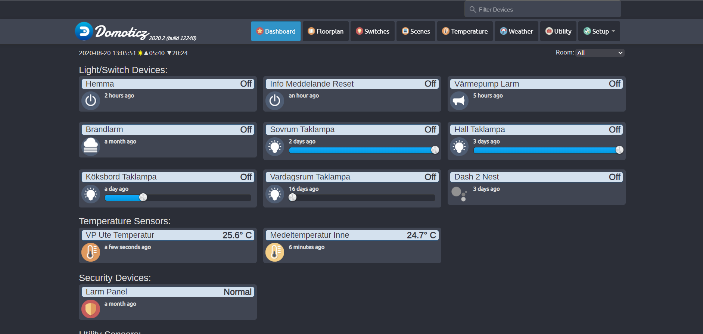

# ThinkTheme (Deprecated)

<i>This theme is deprecated and there is no more support for this theme<i>

ThinkTheme for Domoticz V3.8XXX and above

Modyfied from [ThinkTheme in domoticz forum](http://www.domoticz.com/forum/viewtopic.php?f=8&t=7863)

# Installation
We recommend you to use the [Theme manager plugin](https://github.com/galadril/domoticz-theme-manager) to install and keep up-to-date the theme.

## Manual Installation
NOTE: "${USER}" will automatically take your username. No need to change that. Just copy and paste.
```
cd /home/${USER}/domoticz/www/styles
git clone https://github.com/DewGew/Domoticz-ThinkTheme ThinkTheme
```
## Update theme
```
cd /home/${USER}/domoticz/www/styles/ThinkTheme
git pull
```

# Screenshot


# Changelog
- v2.4.7 Moment.js loads only in domoticz stable
- v2.4.4 Added Theme info in settings/theme
- v2.4.3 Change time_ago to momont.js 
- V2.4.2 Small improvements
- V2.4.1 Improvements
- V2.4.0 Check for ThinkTheme updates
- V2.3.1 Small fixes
- V2.3.0 Added Idx no to Tiles
- V2.2.0 Added Time Ago
- V2.1.0 Approvment and small changes in CSS
- V2.0.0 First release. 
